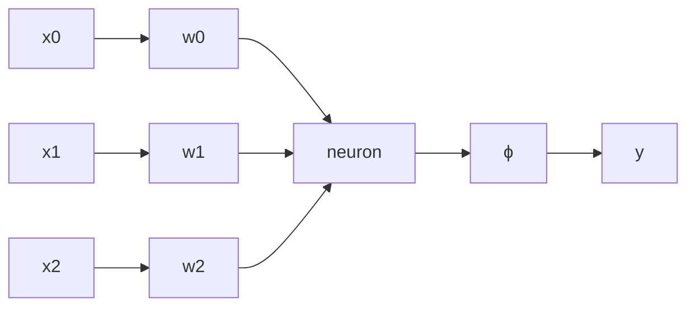

## Learn an `OR` function using the following perceptron:

where:

* $W = [w_0, w_1, w_2] = [-1, 1, -2]$
* $\eta = \frac12$

$w_0$ is a bias and $w_1$ and $w_2$ are the two inputs to the neuron.

We want to adjust the weights until all the input patterns on $x_1$ and $x_2$ produce the correct outputs.

The general method is as follows:

1. Calculate the induced local field by calculating the dot product of the inputs and weights:
	
	$$
	\mathbf x \cdot \mathbf w =\text{ILF}
	$$
	
	For this example:
	
	$$
	\begin{bmatrix}-1 & 0 & 1\end{bmatrix} \cdot\begin{bmatrix}0 & 1 & 0\end{bmatrix}=0
	$$
	
1. Calculate $y$ by using the activation function:

	$$
	y=\phi(\text{ILF})
	$$
	
	The activation function in this case has a positive bias so pulls values $\geq0$ to $1$ and drops values $<0$ to $-1$:
	
	$$
	y=\phi(0) =1
	$$
1. For an input of $x_1=0, x_2=1$ we expect an output of $d=1$. We calculate the error $e$ by taking the difference between $d$ and $y$:

	$$
	\begin{aligned}
	e&=d-y\\
	&=1-1\\
	&=0
	\end{aligned}
	$$

1. If the error is non-zero we adjust the weights by the following function:
	
	$$
	\mathbf w(n+1)=\mathbf w(n)+\eta e(n)\mathbf x(n)
	$$
	
	In this case where no adjustment is needed and $\eta=\frac12$:
	
	$$
	\begin{aligned}
	\mathbf w(n+1)&=\mathbf w(n)+\eta e(n)\mathbf x(n)\\
	&=\begin{bmatrix}0\\1\\0\end{bmatrix}+\frac12\times 0\times\begin{bmatrix}-1\\0\\1\end{bmatrix}\\
	&=\begin{bmatrix}0\\1\\0\end{bmatrix}
	\end{aligned}
	$$