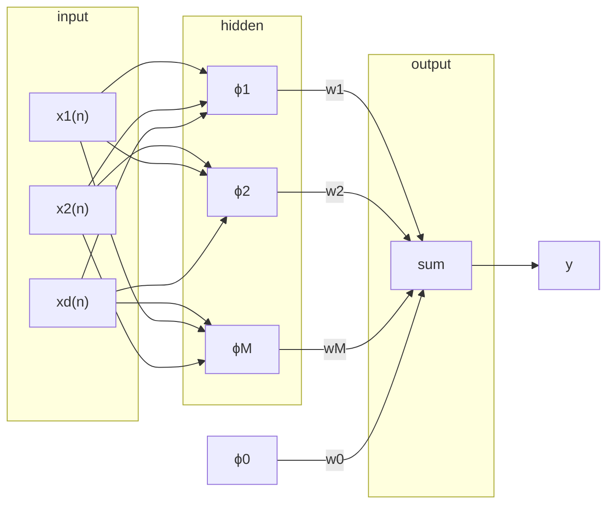

## Pattern Separability
> A complex pattern-classification problem, cast in a high-dimensional space non-linearly, is more likely to be linearly separable than in a low-dimensional space.

This can be reduced to:

* We can use a non-linear function to transform our data so that it can be classified using a linear perceptron.
	
	This has the benefit of using a small network with less layers.
	{:.info}
	
Let $$D=\{\mathbf x_1,\ldots,\mathbf x_N\}$$ be a set of $d$-dimensional patterns which belong to either of two classes $C_1$ or $C_2$.

For each pattern $\mathbf x_i$ we define some real-valued functions $\phi_i(\mathbf x)$ for $i=1,\ldots,b$. This defines teh multivalued mapping:

$$
\phi(\mathbf X)\equiv\left[\phi_1(\mathbf x),\ldots,\phi_b(\mathbf x)\right]^T:\mathbb R^d\rightarrow\mathbb R^b
$$

A dichotomy (binary partition) of the samples in $D$ if $\phi$-separable if there is a vector $\mathbf w$ such that:

$$
\exists\mathbf x\in\mathbb R^b:
\begin{cases}
\mathbf x^T\phi(\mathbf xi)\geq 0&\forall\mathbf x\in C_1\\
\mathbf x^T\phi(\mathbf x)<0&\forall\mathbf x\in C_2
\end{cases}
$$

The hyperplane $\mathbf x^T\phi(\mathbf x)=0$ partitions the $b$-dimensional $\phi$-space to two sides. At the same time the $d$-dimensional input-space to two parts.

Hence instead of using straight lines to partition the space we could use the following:

* Planes
* Spheres/Circles
* Quadrics

This allows us to classify XOR using a linear perceptron instead of using a multi-layer one.
{:.info}

### Interpolation
For a given set of $N$ $d$-dimensional points $\mathbf x_i$, and a corresponding set of associated vlues $y_i$, there is a function $F$ such that $F(\mathbf x_i)=y_i,\forall i$. This is to say there is a surface that passes through all the points in the dataset.

One way for solving this problem is with the method of **radial basis functions** (RBFs). We define a function:

$$
F(\mathbf x)\equiv\sum^N_{i=1}\mathbf w_i\phi(\parallel x-x_i\parallel)
$$

The parallel brackets mean that we calculate the distance between the two points.
{:.info}

$\phi(\parallel x-x_i\parallel)$ is a RBF
: A real-valued function whose value depends only on the distance between the input an some fixed point $x_i$.

#### Commonly Used RBFs

Gaussian Functions:

$$
\phi(r)=\exp\left(-\frac{r^2}{r\sigma^2}\right),\sigma>0,r\in\mathbb R
$$

There are more but they won't be used in this module generally.
{:.info}

## RBF Neural Network
This network approximates the nearest neighbour approach. There is only one hidden layer that uses RBFs instead of a simple sum:

The following functions are used:

$$
\begin{equation}
\tag{1}
F(\mathbf x)=\sum^M_{i=1}w_i\phi_i(\mathbf x)
\end{equation}
$$

$$
\begin{equation}
\tag{2}
\phi_i(\mathbf x)\equiv\exp\left(-\frac{\parallel x-c_i\parallel^2_2}{2\sigma^2_i}\right)
\end{equation}
$$